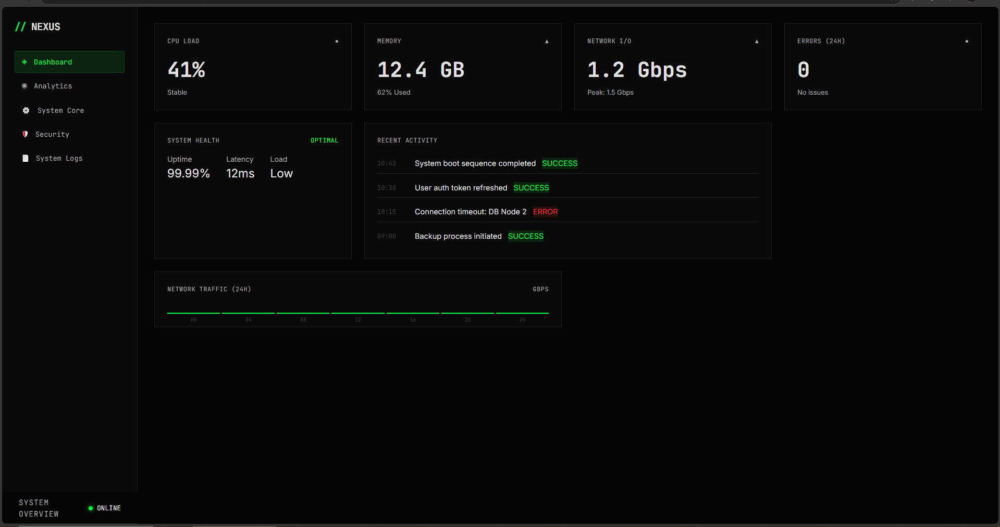

# Nexus-Dashboard

A futuristic cyberpunk-style system monitoring dashboard build with pure HTML, CSS, JavaScript.

## Features

- Responsive Cyberpunk UI (Mobile, Tablet)
- Live Updating stats(CPU)
- Tab navigation (Dashboard, Analytics, System, Security, Logs)
- No Frameworks -- pure vanilla

## How to Run Locally

1. Clone the repo
2. Open 'index.html' in your browser

## Technologies

- HTML5
- CSS3 (Custom Properties + Grid)
- Vanilla JavaScript

---

Made with <3 for cyberpunk aesthetics